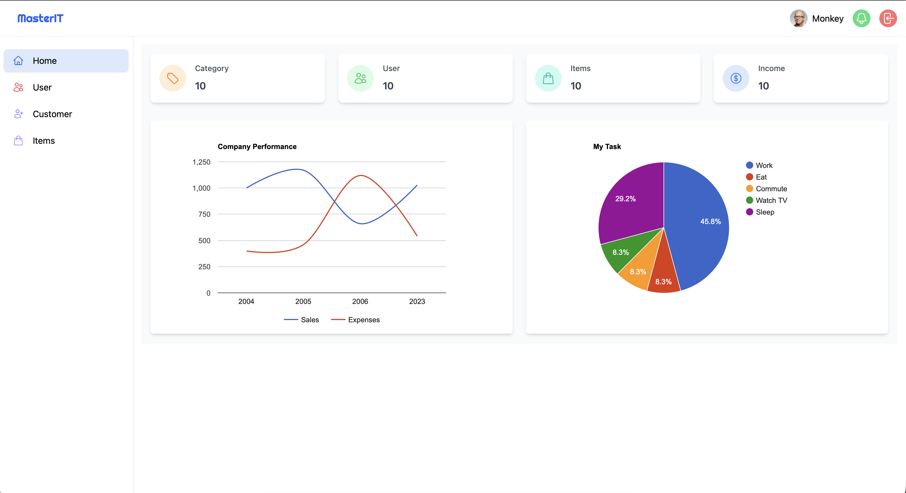

# Responsive Dashboard

A responsive front-end dashboard built using HTML, Tailwind CSS, JavaScript, and Google Charts.

## Live Demo

[View Live Dashboard](https://sokhour5.github.io/responsive-dashboard/)

## Preview



## Features

- Responsive dashboard layout
- Mobile-friendly design
- Interactive charts using Google Charts
- Sales and expenses data visualisation
- Task distribution visualisation
- Responsive navigation and dashboard components
- Utility-first styling with Tailwind CSS

## Technologies Used

- HTML5
- Tailwind CSS
- JavaScript
- Google Charts
- npm
- Git
- GitHub

## Project Overview

This project was created to practise front-end web development and responsive interface design.

The dashboard displays business performance information using charts and structured dashboard components. It also demonstrates responsive layouts that adapt to different screen sizes.

## What I Learned

Through this project, I developed practical experience with:

- Structuring web pages using HTML
- Building responsive interfaces with Tailwind CSS
- Using JavaScript for interactive elements
- Integrating third-party libraries such as Google Charts
- Managing front-end dependencies with npm
- Using Git and GitHub for version control

## Running the Project

Clone the repository:

```bash
git clone https://github.com/sokhour5/responsive-dashboard.git